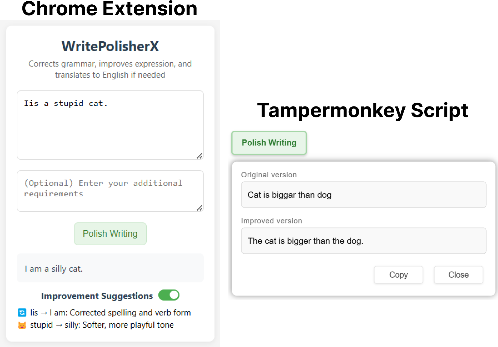

# WritePolisherX

A writing enhancement toolkit that includes both a Chrome extension and a Tampermonkey script. It polishes your writing by correcting grammar, improving expression, and translating non-English text to English when needed.



## Components

### 🎯 Chrome Extension
- Easy-to-use popup interface
- Instant text polishing

- Clear improvement suggestions
- Works with any text input

### 📝 Tampermonkey Script
- Integrates directly into web pages
- Context menu support
- Works with selected text
- Compatible with major websites

## Project Structure

```
├── chrome_extension/
│ ├── popup.html # Extension UI
│ ├── popup.js # Frontend logic
│ ├── styles.css # UI styling
│ └── manifest.json # Extension configuration
│
├── tampermonkey_script/
│ └── script.js # Userscript implementation
│
├── cloud_functions/
├── polish_text/ # Text enhancement API
│ ├── index.js # Main function logic
│ └── package.json
│
├── suggest_points/ # Improvement analysis API
│ ├── index.js # Main function logic
│ └── package.json
```

## Installation

### Chrome Extension
1. Clone this repository
2. Open Chrome and go to `chrome://extensions/`
3. Enable "Developer mode"
4. Click "Load unpacked" and select the `chrome_extension` folder

### Tampermonkey Script
1. Install Tampermonkey browser extension
2. Create new script
3. Copy contents from `tampermonkey_script/script.js`
4. Save and enable the script

## Contact

For any inquiries or feedback, please contact me at [ningzhitang2001@gmail.com](mailto:ningzhitang2001@gmail.com)

## License

This project is licensed under the MIT License. 

Copyright (c) 2025 Ningzhi Tang. All rights reserved.
